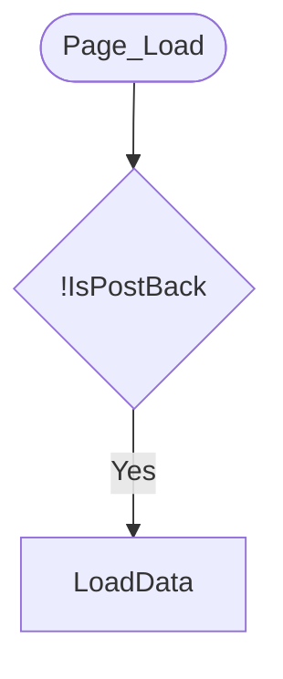

# WebForms Flow Diagram Generator

Automatically generates Mermaid flow diagrams from ASP.NET WebForms C# code-behind files.

## Features

- ✅ Analyzes Page_Load and event handlers automatically
- ✅ Handles if/else, loops, switch, try/catch
- ✅ Detects service/SOAP calls
- ✅ Generates color-coded Mermaid diagrams
- ✅ Works on large files (6000+ lines)

## Installation

```bash
git clone https://github.com/YOUR-USERNAME/webforms-flow-generator.git
cd webforms-flow-generator
dotnet build
```

## Usage

```bash
# Analyze Page_Load and all event handlers
dotnet run /path/to/YourPage.aspx.cs

# Analyze specific method
dotnet run /path/to/YourPage.aspx.cs MethodName
```

## Output

Generates a `.flow.md` file with Mermaid diagrams. View in:

- VS Code (with Mermaid extension)
- GitHub (renders automatically)
- Any Markdown viewer with Mermaid support

## Example

Input C# code:

```csharp
protected void Page_Load(object sender, EventArgs e)
{
    if (!IsPostBack)
    {
        LoadData();
    }
}
```

Output diagram (auto-rendered on GitHub):



## Requirements

- .NET 6.0 or higher
- Microsoft.CodeAnalysis.CSharp NuGet package

## License

MIT License
